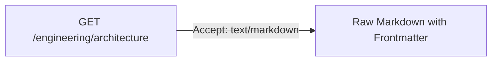

# REST API Design Guide

This document establishes the REST API design principles for the Corpus Server. These rules are designed to ensure consistency, clean structure, excellent content negotiation, and high accessibility for both human developers and argentic AIs.

---

## 1. Stateless Resource-Oriented Modeling
- **Resource Naming**: API paths must represent physical resource entities.
- **File System Mirroring**: The primary path prefix represents directories or files on the disk (e.g., `/engineering/architecture.md`).
- **HTTP Verbs**: Use HTTP methods explicitly mapping to CRUD actions:
  - `GET`: Read document or list directory indexes. Absolutely zero side-effects.
  - `PUT`: Write, edit, or overwrite document body + metadata (idempotent).
  - `DELETE`: Remove document (idempotent).
  - `POST`: Create multi-part binary assets, create index listings, or submit actions.
- **Path Sanitization & Security**:
  - All url slugs used for document paths must be sanitized and validated to prevent directory traversal and Local File Inclusion (LFI) vulnerabilities. Block any traversal paths containing `..` or targeting folders outside the storage folder with a `400 Bad Request` response
  - Incoming url slugs are relative to the base storage folder. The base storage folder is never part of a url request.
- **Static Asset Bypass**: 
  - If a path contains a binary extension (such as `.png`, `.jpg`, `.jpeg`, `.gif`, `.svg`, `.webp`, `.pdf`, `.zip`, `.mp3`), bypass content-negotiation and frontmatter parsing. Stream the binary raw data directly from the disk carrying the matching HTTP `Content-Type` header (e.g. `image/png`).

---

## 2. Robust Content Negotiation
The server must adapt returned payloads dynamically using standard HTTP `Accept` headers.



- **`Accept: text/markdown`**:
  - Returns the raw Markdown directly from the local disk.
  - Keeps payload footprints small for AI agents and terminals.

---

## 3. Idempotency & Clean Write Loops
- **`PUT` for Documents**:
  - Sending the identical payload multiple times must leave the server in the identical state (updating the `updated` in the document's frontmatter timestamp appropriately).
- **Safe Read-Before-Write**:
  - AI agents and automated scripts should always run a `GET` request on a path prior to submitting a `PUT` update. This prevents overwriting concurrent edits or clearing custom frontmatter fields.

---

## 4. Standardized Error Formats
All API errors must return correct HTTP status codes coupled with a clean, predictable JSON body. Never return raw HTML stack traces or plain text errors.

### Error Payload Format
```json
{
  "code": "NOT_FOUND",
  "message": "The requested document 'engineering/architecture' does not exist.",
  "path": "/engineering/architecture",
  "timestamp": "2026-05-30T21:42:00Z"
}
```

### Standard Status Codes
- **`400 Bad Request`**: Malformed request structure, invalid YAML frontmatter, or schema validation failures.
- **`401 Unauthorized`**: Token missing, expired, or rejected.
- **`403 Forbidden`**: Valid token provided, but caller lacks sufficient ACL privileges (`roles` or `users`) for the specified file/folder.
- **`404 Not Found`**: Target file or folder directory doesn't exist on disk.
- **`500 Internal Server Error`**: Unexpected system exceptions (e.g. disk full, operating system locks).

---

## 5. AI-Friendliness Principles
An API designed for AI agents utilizes patterns that make parsing, writing, and exploration intuitive:

- **Comprehensive Indexes**: 
  - Requesting a directory route must provide complete lists of child folders and documents alongside their parsed frontmatter descriptions, tags, and last-modified dates.
- **Semantic Consistency**: Keep schemas rigid. Once a frontmatter standard is defined (such as `title`, `description`, `tags`), keep it consistent. Do not mix camelCase and snake_case in API keys (always use standard camelCase).
- **Self-Documenting API**: Provide clear OpenAPI specifications (exposed natively by Elysia.js via Swagger) to allow developer exploration and quick LLM ingestion.
