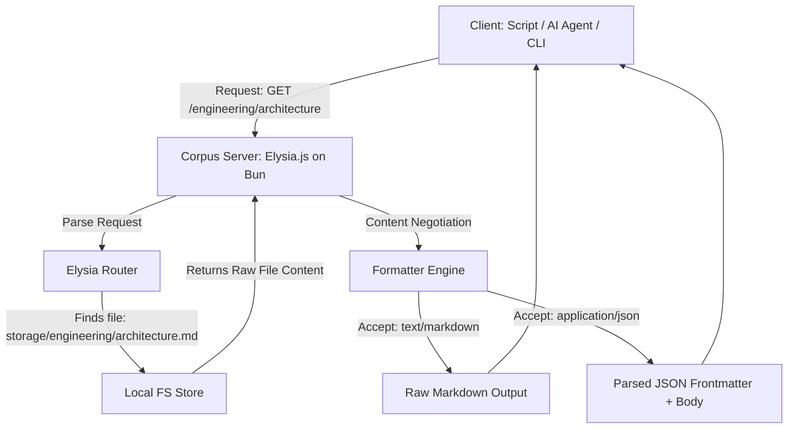

# Corpus Server

Corpus Server is a lightweight, high-performance web API that hosts raw Markdown documents instead of traditional HTML. It is designed to be the ultimate single-source-of-truth knowledge base, engineered specifically for co-habitation between human developers/writers and AI agents.

By storing knowledge in standard Markdown with structured YAML frontmatter, Corpus Server preserves the simplicity of a normal hierarchical file system while exposing robust REST APIs, content negotiation, and powerful indexing using the Bun runtime and Elysia.js framework.

---

## Table of Contents
1. [Core Philosophy](#core-philosophy)
2. [Architectural Overview](#architectural-overview)
3. [The Frontmatter Metadata Standard](#the-frontmatter-metadata-standard)
4. [API Specification & Endpoints](#api-specification--endpoints)
5. [Content Negotiation: Markdown vs. JSON](#content-negotiation-markdown-vs-json)
6. [Dynamic Directory Indexing](#dynamic-directory-indexing)
7. [AI Agent Integration Guide](#ai-agent-integration-guide)
8. [Security & Access Control (ACL)](#security--access-control-acl)
9. [Server Configuration](#server-configuration)
10. [Reference Implementation Blueprint](#reference-implementation-blueprint)

---

## Core Philosophy

Traditional wikis and knowledge bases compile Markdown into heavy, opinionated HTML/CSS pages. While beautiful for standard web browsers, this compilation strips out semantic raw data, clutters the payload, and makes it incredibly expensive (in token consumption and parsing complexity) for AI agents and developer-written automation tools to read, reason over, and write to.

Corpus Server solves this by operating as a high-speed, API-first Markdown server. It adopts a dual-format model served strictly over raw text and JSON:
- **For Content Creators & Editors**: A highly predictable filesystem mapping where raw Markdown documents can be created, updated, and organized via standard REST APIs.
- **For AI & Automation**: A ultra-clean API that serves raw Markdown, parses metadata directly into JSON, and offers recursive directory traversal with zero HTML boilerplate.

### Why Markdown + File System?
- **Zero Lock-in**: Your knowledge base is just a folder of text files. If the server dies, your files remain perfectly readable.
- **Git Friendly**: The entire server database can be backed up, versioned, and branched using standard Git.
- **Extensible**: Adding metadata is as simple as writing standard YAML at the top of a file.

---

## Architectural Overview

Corpus Server maps a local directory structure directly to Elysia.js routes.



1. **Storage Engine**: A pure directory tree on the server disk containing `.md` files and asset folders (images, PDFs).
2. **Metadata Engine**: An on-the-fly or background-cached YAML frontmatter parser.
3. **Index Generator**: A dynamic directory-listing system that constructs indexes for folder routes (e.g., `/engineering/`) including child file metadata.
4. **Search Provider**: A search engine (such as SQLite FTS5 or a Vector Embeddings index) querying the documents and frontmatter fields.

---

## The Frontmatter Metadata Standard

Every document on the server should start with a YAML frontmatter block enclosed by triple-dashed lines (`---`). This acts as the database record for the document.

### Standard Schema
```markdown
---
title: "System Architecture Design"
description: "A comprehensive spec of the microservices layout and data flows."
created: 2026-05-30T21:00:00Z
updated: 2026-05-30T21:00:00Z
author: "Dave <dave@company.com>"
tags: [architecture, backend, spec]
security:
  level: "internal"
  roles: ["engineering", "product"]
ai:
  priority: "high"
  ignore: false
  summary: "This document describes the 3-tier microservice architecture and data pipelines."
custom:
  version: "v2.1"
  status: "approved"
---
# Actual Document Heading

Document body begins here...
```

### Metadata Fields Detail
| Field | Type | Description | Required |
| :--- | :--- | :--- | :--- |
| `title` | String | Human-readable title of the document. Defaults to the filename if omitted. | Yes |
| `description` | String | A brief summary of the document's contents. | Yes |
| `created` | ISO8601 | Timestamp when the document was initially published. | Yes |
| `updated` | ISO8601 | Timestamp of the last revision. | Yes |
| `author` | String | Name/Email of the owner of the document. | No |
| `tags` | Array | List of strings for categorizing and search filtering. | No |
| `security` | Object | Access control configuration defining permission tiers. | No |
| `ai` | Object | Optimization metadata for LLMs and indexing scripts. | No |
| `custom` | Object | Free-form key-value pairs for organizational extension. | No |

---

## API Specification & Endpoints

Corpus Server provides a complete CRUD API mapped straight to the folder tree using Elysia.js routing.

### Request Safety & File Handling

To ensure high system security and support media files alongside Markdown text, the server enforces strict pre-routing rules:

1. **Path Sanitization & Traversal Prevention**:
   - Every incoming request path is resolved to an absolute, canonical filesystem path using standard path resolution helpers (e.g. Bun's path utils).
   - The resolved absolute system path **must strictly begin** with the `/storage` root directory.
   - Any path resolving outside `/storage` or containing traversal components (e.g. `..`) is immediately blocked and returns a `400 Bad Request` or `403 Forbidden` response to prevent Local File Inclusion (LFI).
2. **Static Asset & Binary Serving**:
   - If the requested path resolves to a file containing a non-markdown binary file extension (such as `.png`, `.jpg`, `.jpeg`, `.gif`, `.svg`, `.webp`, `.pdf`, `.zip`, `.mp3`), Corpus Server bypasses standard Markdown frontmatter parsing and content-negotiation.
   - The file is streamed straight from disk with its native binary structure carrying the exact matching MIME type (e.g. `image/png` or `application/pdf`).

---

### 1. Retrieve a Document or Folder Index
* **Method**: `GET`
* **Path**: `/*` (e.g., `/engineering/design` or `/engineering/`)
* **Headers**:
  * `Accept`: `text/markdown` | `application/json` (Defaults to `text/markdown`)
* **Responses**:
  * **200 OK (File)**: Returns the document in the requested format (raw Markdown or parsed JSON).
  * **200 OK (Directory)**: Returns a generated index listing child documents and folders.
  * **404 Not Found**: File or folder does not exist.
  * **403 Forbidden**: Caller lacks sufficient ACL permissions.

### 2. Create or Update a Document
* **Method**: `PUT`
* **Path**: `/path/to/document.md` or `/path/to/document`
* **Headers**:
  * `Content-Type`: `text/markdown` or `application/json`
  * `Authorization`: `Bearer <token>`
* **Request Payload (if `text/markdown`)**:
  Raw markdown content containing frontmatter.
* **Request Payload (if `application/json`)**:
  ```json
  {
    "frontmatter": {
      "title": "New Document",
      "description": "Short summary",
      "tags": ["temp"]
    },
    "body": "# Document Heading\nThis is the content."
  }
  ```
* **Responses**:
  * **201 Created**: Document created successfully.
  * **200 OK**: Document updated successfully.
  * **400 Bad Request**: Missing required frontmatter fields or malformed markdown.

### 3. Upload a Binary Asset
* **Method**: `POST`
* **Path**: `/path/to/folder/_assets`
* **Headers**:
  * `Content-Type`: `multipart/form-data`
  * `Authorization`: `Bearer <token>`
* **Responses**:
  * **201 Created**: Asset saved. Returns JSON containing the Markdown image/file link:
    ```json
    {
      "url": "/path/to/folder/_assets/image.png",
      "markdown": ""
    }
    ```

### 4. Delete a Document
* **Method**: `DELETE`
* **Path**: `/path/to/document`
* **Headers**:
  * `Authorization`: `Bearer <token>`
* **Responses**:
  * **204 No Content**: Document deleted successfully.
  * **404 Not Found**: Document doesn't exist.

### 5. Unified Search
* **Method**: `GET`
* **Path**: `/_search`
* **Query Parameters**:
  * `q`: Search term (supports basic boolean operators).
  * `type`: `fulltext` (default) | `semantic` (vector) | `tags`
  * `scope`: Restricted directory prefix (e.g. `/engineering`)
* **Responses**:
  * **200 OK**: Returns a JSON list of matches:
    ```json
    {
      "query": "microservice design",
      "results": [
        {
          "path": "/engineering/architecture.md",
          "title": "System Architecture Design",
          "description": "A comprehensive spec of the microservices layout...",
          "score": 0.94,
          "highlights": ["...microservices design layout..."]
        }
      ]
    }
    ```

---

## Content Negotiation: Markdown vs. JSON

The client controls the representation of the response through standard HTTP `Accept` headers.

### A. Raw Markdown Content (`Accept: text/markdown`)
The server returns **pure, unmodified raw text content** directly from disk (complete with its YAML frontmatter header).
- Ideal for AI agents, developers utilizing CLI tools, and markdown-compatible editors.
- Zero extra payload overhead, offering minimal latency and maximum portability.

### B. Parsed Document Object (`Accept: application/json`)
The server parses the file on-the-fly, splits the metadata from the structural content, and presents it as a clean JSON object:
```json
{
  "path": "/engineering/architecture.md",
  "frontmatter": {
    "title": "System Architecture Design",
    "description": "A comprehensive spec...",
    "created": "2026-05-30T21:00:00Z",
    "updated": "2026-05-30T21:00:00Z",
    "author": "Dave <dave@company.com>",
    "tags": ["architecture", "backend"]
  },
  "body": "# Actual Document Heading\n\nDocument body begins here...",
  "headings": [
    { "depth": 1, "text": "Actual Document Heading", "anchor": "#actual-document-heading" }
  ]
}
```

---

## Dynamic Directory Indexing

When a route represents a directory on disk (e.g. `GET /engineering`), the server checks if there is a primary document representing that folder (a physical file named `/engineering/index.md` or `/engineering.md`). 

If no explicit document covers the folder, or in addition to it, the server auto-generates a dynamic **Folder Index Page**.

### Pagination for Large Listings
To ensure scalable performance across extensive directories, folder routes accept optional query parameters:
- `limit`: The maximum number of documents to return (default: `100`, max: `500`).
- `offset`: The number of items to skip for pagination (default: `0`).

### JSON Structure (`Accept: application/json`)
```json
{
  "directory": "/engineering",
  "parent": "/",
  "totalFiles": 48,
  "limit": 100,
  "offset": 0,
  "folders": [
    {
      "name": "architecture",
      "path": "/engineering/architecture",
      "childCount": 12
    }
  ],
  "files": [
    {
      "name": "onboarding.md",
      "path": "/engineering/onboarding",
      "size": 4200,
      "updated": "2026-05-29T18:15:00Z",
      "metadata": {
        "title": "Engineering Onboarding",
        "description": "How to get set up with your local dev environment.",
        "tags": ["onboarding", "setup"],
        "author": "Alice"
      }
    }
  ]
}
```

### Markdown Structure (`Accept: text/markdown`)
If requested as raw Markdown, the server constructs a clean, hierarchical catalog:

```markdown
# Index of `/engineering`

## Subfolders
* [architecture](/engineering/architecture) (12 items)

## Documents
* **[Engineering Onboarding](/engineering/onboarding)**
  * *Description*: How to get set up with your local dev environment.
  * *Tags*: `onboarding`, `setup`
  * *Author*: Alice
  * *Last Modified*: 2026-05-29
```

---

## AI Agent Integration Guide

Corpus Server is engineered to be an excellent backend for agentic AI workflows. When writing agents that interact with this server, observe the following conventions:

### Recommended AI System Instructions
Include this configuration snippet inside your agent's system prompt:
```text
- When looking up knowledge or researching, ALWAYS request 'Accept: text/markdown' or 'application/json' to keep token usage low.
- To discover what knowledge exists, request directory paths directly (e.g., GET /engineering/) to receive a structured metadata index of all sub-documents.
- When creating or editing documents, format your request with a YAML frontmatter block containing 'title', 'description', 'created', 'updated', and 'tags' fields. Ensure dates are in ISO 8601 format.
- Always perform a GET request on a file before writing/updating it to obtain the latest version and preserve custom frontmatter fields.
```

### Agent Read-Write Loop
1. **Discover**: Call `GET /` to see high-level domains (folders).
2. **Search**: Call `GET /_search?q=topic` to instantly locate deep documents.
3. **Read**: Call `GET /engineering/architecture` with `Accept: text/markdown` to digest the spec.
4. **Draft**: Formulate changes, ensuring the YAML frontmatter updates the `updated` timestamp.
5. **Write**: Perform a `PUT` request with the complete revised Markdown document.

---

## Security & Access Control (ACL)

To support multi-user teams, organizational access, and automated AI agents, Corpus Server offers flexible authentication strategies. In production, standard OpenID Connect (OIDC), OAuth, and Client Credentials flows issuing JWT tokens are supported. For local development, testing, and small-scale deployments, the server supports a secure, zero-dependency Pre-Shared Static Token model.

### Authentication Flows

Both humans and AI clients authenticate via standard Authorization headers: `Authorization: Bearer <token_or_jwt>`. The server supports three primary mechanisms to validate and extract client identity:

#### 1. Human Authentication (Authorization Code Flow)
- **Mechanism**: Humans authenticate using local email/password pairs, or federated sign-in via external OAuth 2.0 / OpenID Connect (OIDC) providers (e.g., Google, GitHub, Okta, Microsoft).
- **Workflow**: 
  - **Internal Auth**: A standard authorization endpoint verifies email/password credentials and initiates the local authorization code exchange.
  - **External Providers**: The user is redirected to the external provider's OAuth authorize page. Upon login, the provider redirects the user back to the Corpus Server callback endpoint with an authorization code. Corpus Server exchanges this code for an access/id token from the provider, resolves the user profile, maps provider-level groups or teams (e.g., GitHub teams, Okta groups) to local roles, and issues a normalized local JWT.
- **JWT Content Example**:
  ```json
  {
    "sub": "dave@company.com",
    "type": "human",
    "roles": ["engineering", "admin"],
    "provider": "github",
    "iat": 1778152800,
    "exp": 1778188800
  }
  ```

#### 2. AI & Machine Authentication (Client Credentials Flow)
- **Mechanism**: AI agents, CI/CD pipelines, and script clients supply a `client_id` and `client_secret` directly to the token endpoint.
- **Workflow**: The server validates the credentials and issues a machine-centric JWT. This maintains a unified authorization downstream path where both humans and AI present identical headers (`Authorization: Bearer <JWT>`).
- **JWT Content Example**:
  ```json
  {
    "sub": "ai-indexer-agent",
    "type": "agent",
    "roles": ["indexer", "read-all"],
    "iat": 1778152800,
    "exp": 1778188800
  }
  ```

#### 3. Developer & Small-Scale Alternative (Pre-Shared Static Tokens)
- **Mechanism**: For local testing, offline development, or simple small-scale deployments, administrators can bypass dynamic JWT generation and identity provider setups entirely.
- **Workflow**: The server loads a local `config.yaml` during startup, mapping static pre-shared tokens to identities:
  ```yaml
  # config.yaml
  tokens:
    - token: "corp_usr_dave_7f839a2b"
      sub: "dave@company.com"
      type: "human"
      roles: ["engineering", "admin"]

    - token: "corp_agt_indexer_9c2d1e0f"
      sub: "ai-indexer-agent"
      type: "agent"
      roles: ["indexer", "read-all"]
  ```
- **Verification**: The Elysia.js middleware intercepts the `Authorization: Bearer <token>` header, matches it against the in-memory static map, and directly populates the request context with the identity details.

---

### Three-Tier Document Authorization

Every Markdown document has an access tier declared in its YAML frontmatter under `security.level`. If not explicitly declared, the document falls back to the directory's default security configuration (or defaults to `private`).

| Security Level | Description | Auth Required | Authorized Identities |
| :--- | :--- | :--- | :--- |
| `public` | Universal viewing. Useful for public docs, FAQs, and open wikis. | No | Anyone (anonymous requests). |
| `private` | Authenticated viewing. Accessible to any logged-in human or AI agent. | Yes | Any valid JWT or static token holder. |
| `confidential` | Granular viewing. Restricted to specific usernames/client IDs or roles. | Yes | JWT or static token holders matching specified `roles` or `users` in the ACL. |

#### Frontmatter Examples

##### Public Document
```markdown
---
title: "Public FAQ"
security:
  level: "public"
---
# Frequently Asked Questions
This document can be accessed without providing an Authorization header.
```

##### Private Document
```markdown
---
title: "Internal Developer Guide"
security:
  level: "private"
---
# Internal Developer Guide
Any verified team member or active AI agent can view this.
```

##### Confidential Document
```markdown
---
title: "Quarterly Compensation Reviews"
security:
  level: "confidential"
  roles: ["hr", "executive"]
  users: ["dave@company.com"]
---
# Executive Compensation Review
Only logged-in accounts carrying the 'hr' or 'executive' role, or specifically identified by username/client ID 'dave@company.com', can access this file.
```

---

### Global and Folder-Level Defaults (`.acl.yaml`)

To prevent having to define security levels on every single document, a folder can contain a hidden `.acl.yaml` configuration file. The rules in this file apply recursively to all documents and subdirectories inside it unless overridden by a document's own frontmatter.

```yaml
# storage/engineering/.acl.yaml
security:
  level: "confidential"
  roles: ["engineering"]
  users: ["external-collaborator-agent"]
```

---

### Document Content Encryption

To protect sensitive information at rest, the body content of every Markdown document (everything excluding the YAML frontmatter) is stored encrypted on disk. When an authorised client requests a document, the server decrypts the content in memory and transmits the plaintext to the client over the established secure channel. The frontmatter itself is stored in plaintext to allow the server to evaluate access control rules (e.g., `security.level`, roles, and users) without first decrypting the body.

This means that even if the underlying storage is compromised, document bodies remain unreadable without access to the server's encryption keys.

---

## Server Configuration

Corpus Server dynamically configures its network, filesystem storage, indexing engine, and security adapters via a local `config.yaml` located at the root of the project.

### Configuration Schema (`config.yaml`)

```yaml
# Network and server binding properties
server:
  host: "0.0.0.0"       # Bind interface
  port: 3000            # Port Elysia.js listens on

# Base storage path mapping
storage:
  root: "./storage"     # Root directory of your markdown database
  assetsDir: "_assets"  # Local name for binary subfolders

# Database cache and indexing settings
database:
  type: "persistent"    # "persistent" (saves index to disk) or "in-memory" (fast testing)
  path: "./index.db"    # Path to SQLite file (use ":memory:" if in-memory)

# Active authentication and security options
auth:
  # "static" (pre-shared config keys), "jwt" (full OIDC/JWT signatures), "forward-auth" (from proxy headers), or "none" (open)
  type: "static"
  
  # Secret key used to sign and verify local JWTs (if type: "jwt")
  jwtSecret: "super-secure-rotation-secret-key-change-me"
  
  # Pre-shared static token database (processed if type: "static")
  tokens:
    - token: "corp_usr_dave_7f839a2b"
      sub: "dave@company.com"
      type: "human"
      roles: ["engineering", "admin"]

    - token: "corp_agt_indexer_9c2d1e0f"
      sub: "ai-indexer-agent"
      type: "agent"
      roles: ["indexer", "read-all"]
```

---

## Reference Implementation Blueprint

Corpus Server is designed to execute as a high-performance service on the **Bun** runtime using **Elysia.js**.

### Directory Structure of a Running Server
```text
corpus-server/
├── storage/               # Direct mapping of your KB files
│   ├── .acl.yaml          # Root ACL permissions
│   ├── index.md           # Root Index file
│   ├── engineering/
│   │   ├── .acl.yaml      # Engineering folder ACL overrides
│   │   ├── architecture.md
│   │   └── onboarding.md
│   └── product/
│       └── roadmap.md
├── src/                   # Server Source Code
│   ├── index.ts           # Elysia.js entry point & route registration
│   ├── acl.ts             # Permission parsing and verification
│   ├── parser.ts          # YAML frontmatter parsing and normalization
│   └── search.ts          # SQLite FTS5 search indexer
├── bun.lockb              # Bun lockfile
├── package.json           # Node compatibility dependencies
├── tsconfig.json          # TypeScript compilation configuration
└── README.md              # This technical specification
```

### Recommended Technology Stack
- **Runtime Environment**: **Bun** (v1.1+) for rapid startup, high I/O performance, and built-in SQLite support.
- **Web Framework**: **Elysia.js** for high-throughput, type-safe API routing.
- **Frontmatter Parser**: Fast native YAML parsing or JS libraries such as `gray-matter` / `yaml` to extract meta attributes.
- **In-Memory Cache & Search**: **SQLite** (using Bun's high-speed `bun:sqlite` API) with the `FTS5` extension. On server boot, recursively scan the `/storage` directory, parse frontmatter, and populate a memory-backed SQLite DB to enable sub-millisecond search and index requests.
- **FTS Cache Syncing & Invalidation**: To handle out-of-band updates (e.g. standard file uploads, git pulls, or local modifications), the server initializes a recursive file system watcher (using `chokidar` or Bun's native folder watcher) on the `/storage` directory. 
  - **On Add / Change**: The server reads the modified file, parses the frontmatter, and upserts the record into the FTS SQLite DB.
  - **On Delete**: The server removes the matching file path record from the SQLite index, ensuring zero-latency sync without rebuilding the entire DB on every edit.

---

*This document is formatted for optimized indexing. Both humans and AI parser agents are fully authorized to read and interpret this technical structure.*
